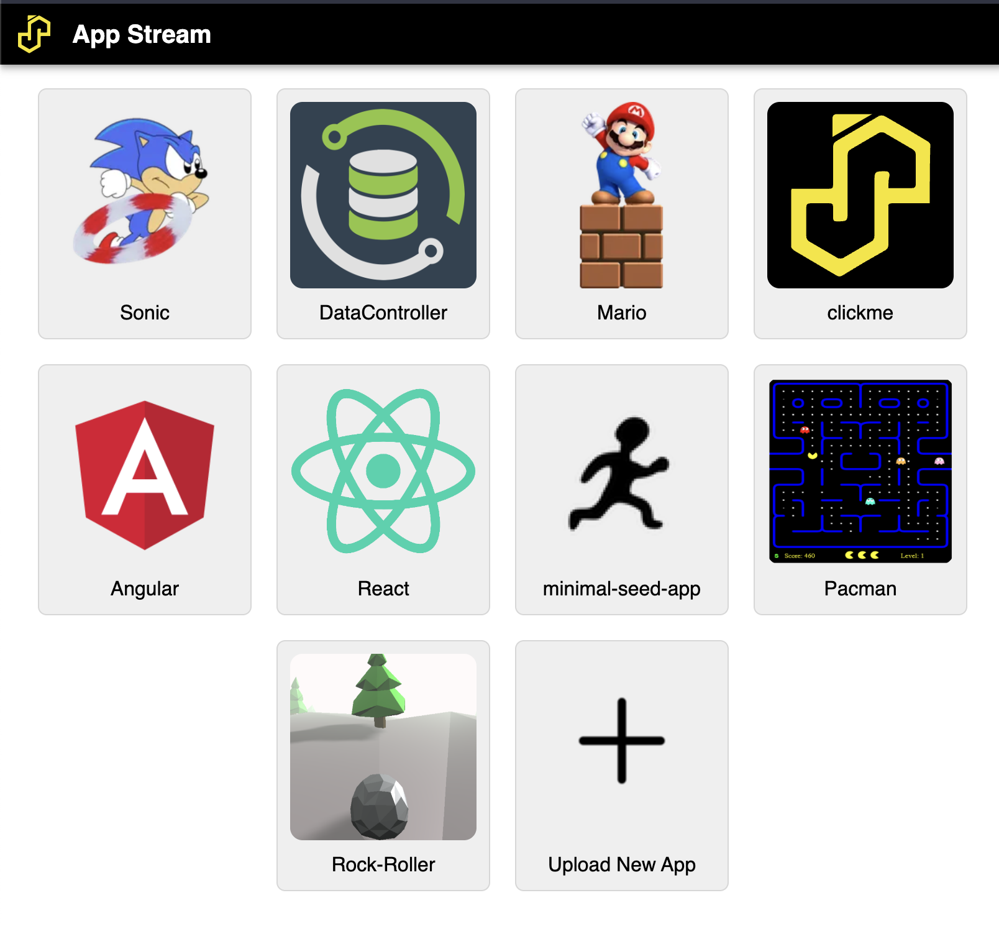

# Apps

The apps portal is a gateway to any apps that you have deployed to SASjs Server.

## Creating Apps

Anybody can create an app for SASjs Server - it just needs to be compiled using the [SASjs CLI](https://cli.sasjs.io/compile).  The output of this process is a zip file that can be imported to any SASjs Server instance.

## Deploying Apps

Simply click the "Upload New App" button and select the local zip file containing the app you wish to deploy.

Alternative deployment approaches include:

* `sasjs deploy` - [https://cli.sasjs.io/deploy/](https://cli.sasjs.io/deploy/)
* Use the `/SASjsApi/drive/deploy/upload` API
* Use the `/SASjsApi/drive/deploy` API

## Available Apps

SASjs Server does NOT contain an in-built "app store", however you may download apps from the following locations and upload them to your SASjs Server instance.

### Data Controller for SAS®

[Data Controller](https://datacontroller.io) is a full-blown SAS application to provide business users with a carefully-controlled capability to make changes to data in SAS.

The app can be downloaded from here: [https://git.4gl.io/dc/deploy/raw/branch/main/server.json.zip](https://git.4gl.io/dc/deploy/raw/branch/main/server.json.zip).

And documentation is here: [https://docs.datacontroller.io](https://docs.datacontroller.io).

### Minimal Seed App

This is simply a demo app built with Vanilla JS and SAS.  You can find the latest version on the github [releases [page](https://github.com/sasjs/minimal-seed-app/releases)

### Pacman

A video game classic! Release assets are available here: [https://github.com/sasjs/pacman/releases](https://github.com/sasjs/pacman/releases)

## Access Permissions

If you are running in "Server" mode you can grant permissions at the level of User or Group to any uploaded application - just click on your username, then "Settings", then "Permissions" to create the necessary rule(s).
