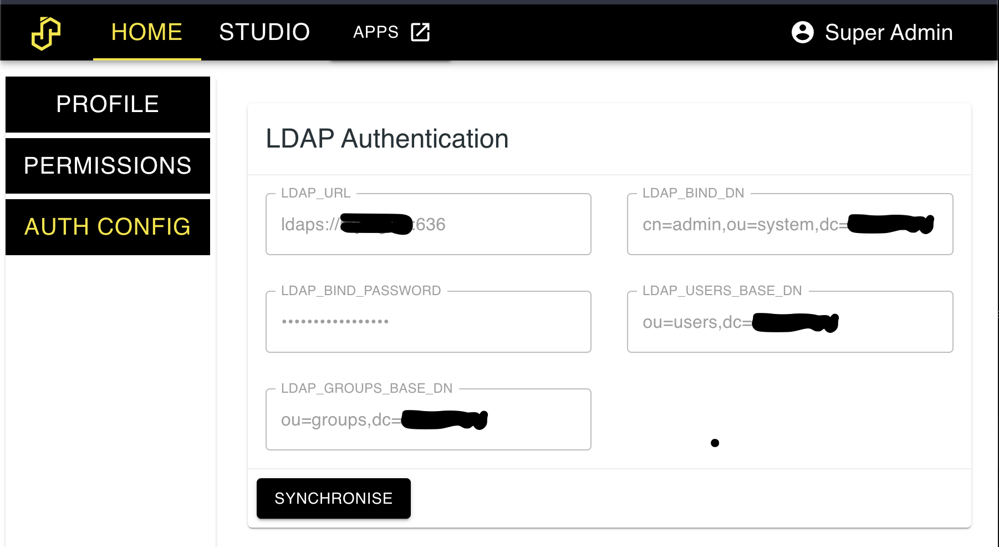

# Authentication

SASjs Server currently supports two authentication methods - LDAP, and Internal.  Would you like to see more?  [Sponsor](https://github.com/sponsors/sasjs) us!

Note that authentication is only available in **server mode** (not desktop).

## Internal Authentication

By default, users are created using the internal database with a password configured by an admin.  Groups can also be added, and permissions set against those groups.

## LDAP Authentication

SASjs Server can connect to an LDAP server (internally, we use the [LDAPjs](http://ldapjs.org/client.html) library).  Any users / groups that are imported will be in _addition_ to any internal users / groups.  If there are conflicts, those particular users/groups will not be imported - to fix this, just delete the relevant (SASjs internal) users/groups and re-import.

Note that at least one internal admin user is necessary, to be able to log in and do the import.  After this, the internal user may nominate other (LDAP) users as SASjs admins.

Configuration is made in the following `.env` settings:

```
AUTH_PROVIDERS=ldap
LDAP_URL= ldaps://LDAP_SERVER_URL:PORT
LDAP_BIND_DN= cn=admin,ou=system,dc=companyname
LDAP_BIND_PASSWORD = <password>
LDAP_USERS_BASE_DN = ou=users,dc=companyname
LDAP_GROUPS_BASE_DN = ou=groups,dc=companyname
```

Next, restart the server and log in with the admin user. Navigate to the settings tab.  You should see a screen like the below.  Import the users & groups by clicking the 'synchronise' button.



## Brute Force Protection

SASjs Server now protects authentication endpoints from DDoS and brute force attacks at any scale. We adopted a simple and powerful technique to block authorization attempts using two metrics:

1. The first is number of consecutive failed attempts by the same user name and IP address.
2. The second is number of failed attempts from an IP address over some long period of time. For example, block an IP address if it makes 100 failed attempts in one day.

To achieve above metrics we used an npm package [rate-limiter-flexible](https://www.npmjs.com/package/rate-limiter-flexible).

This technique has following configurable env variables:

```
# After this, access is blocked for 1 day
# default: 100
MAX_WRONG_ATTEMPTS_BY_IP_PER_DAY = <number>

# After this, access is blocked for an hour
# Store number for 90 days since first fail
# Once a successful login is attempted, it resets
# Default: 10
MAX_CONSECUTIVE_FAILS_BY_USERNAME_AND_IP = <number>
```

## Admin Account

The default credentials for login are `secretuser` and `secretpassword`.  These can be adjusted using the ADMIN_USERNAME and ADMIN_PASSWORD_INITIAL options on server startup.  

If the admin password is misplaced, it can be reset by restarting the server with `ADMIN_PASSWORD_RESET=YES`.  Be sure to set it back to NO (or remove the option) to prevent the password being reset on any subsequent server restart.
