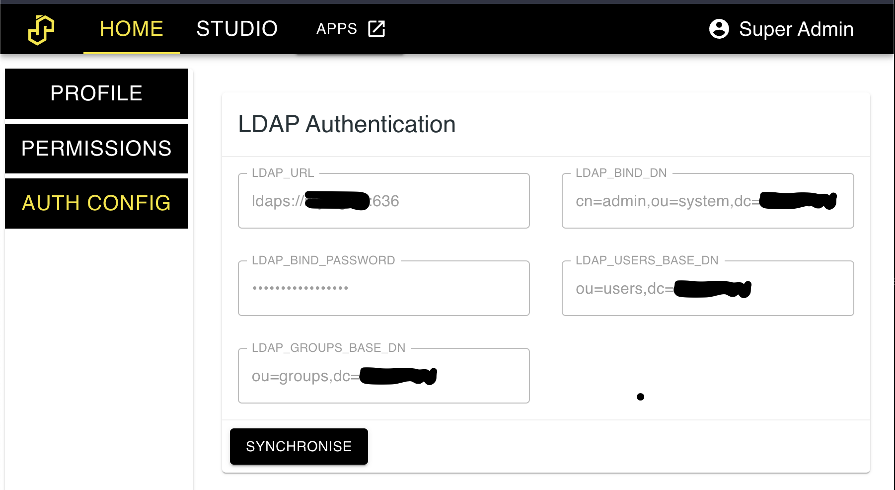

# Authentication

SASjs Server supports three authentication methods - Internal, LDAP, and OpenID Connect (OIDC).

These are selected with [AUTH_PROVIDERS](/settings/#auth_providers), which is a **list** - more than one may be enabled at once, for example LDAP for directory users together with OIDC for single sign-on.

Note that authentication is only available in **server mode** (not desktop).

## Internal Authentication

By default, users are created using the internal database with a password configured by an admin.  Groups can also be added, and permissions set against those groups.

### Disabling the local password login

Where every account lives in an identity provider, the internal password path can be switched off entirely: set [LOCAL_LOGIN_ENABLED](/settings/#local_login_enabled) to `false` and a local account cannot sign in at all, because the stored password is never compared.  LDAP-verified sign-in and the provider's own sign-in keep working.

This matters most behind a platform whose login wall is bypassed for programmatic clients.  On Cloudron, for example, the app manifest sets `supportsBearerAuth: true` so that Bearer-token clients reach the API directly - which also means the platform's login wall and MFA are skipped for any request carrying that header, leaving `/SASLogon/login` reachable from the internet.  With no local accounts able to sign in, there is no password there to guess.

## LDAP Authentication

SASjs Server can connect to an LDAP server (internally, we use the [LDAPjs](http://ldapjs.org/client.html) library).  Any users / groups that are imported will be in _addition_ to any internal users / groups.  If there are conflicts, those particular users/groups will not be imported - to fix this, just delete the relevant (SASjs internal) users/groups and re-import.

Note that at least one internal admin user is necessary, to be able to log in and do the import.  After this, the internal user may nominate other (LDAP) users as SASjs admins.

Configuration is made in the following `.env` settings:

```
AUTH_PROVIDERS=ldap
LDAP_URL= ldaps://LDAP_SERVER_URL:PORT
LDAP_BIND_DN= cn=admin,ou=system,dc=companyname
LDAP_BIND_PASSWORD = <password>
LDAP_USERS_BASE_DN = ou=users,dc=companyname
LDAP_GROUPS_BASE_DN = ou=groups,dc=companyname
```

Next, restart the server and log in with the admin user. Navigate to the settings tab.  You should see a screen like the below.  Import the users & groups by clicking the 'synchronise' button.



## OpenID Connect Authentication

SASjs Server can act as an OpenID Connect relying party, so users can sign in with any compliant provider (Okta, Entra ID, Keycloak, Google, Auth0, and so on).  It is driven entirely by the provider's own discovery document, so no provider-specific code is involved - only configuration.

When OIDC is configured, a **"Sign in with ..." button** appears on the login screen automatically.  The password form stays below it, so internal and LDAP users are unaffected - and a local admin can still sign in if the provider is unavailable.

### Configuration

```env
AUTH_PROVIDERS=oidc
OIDC_ISSUER_URL=https://id.example.com
OIDC_CLIENT_ID=sasjs-server
OIDC_CLIENT_SECRET=<client secret>
OIDC_REDIRECT_URI=https://sas.example.com/SASLogon/openid/callback
```

The endpoints are then read from `<OIDC_ISSUER_URL>/.well-known/openid-configuration`.  If your provider does not serve discovery at that path, supply it directly with [OIDC_DISCOVERY_URL](/settings/#oidc_discovery_url) instead.

Register `OIDC_REDIRECT_URI` with your provider as the callback URL - the full URL, including the `/SASLogon/openid/callback` path.  It must match exactly.

The remaining settings are optional and are listed under [Settings](/settings/#oidc_issuer_url).

### PKCE

Sign-in uses PKCE (RFC 7636) with the `S256` challenge method: a per-attempt verifier is kept server-side, only its SHA-256 digest travels in the authorization request, and the code exchange sends the verifier - so a code intercepted in the browser cannot be redeemed by anything except the client instance that started the flow.

There is nothing to configure.  The challenge is always sent, and your provider needs no extra registration for it; providers that **require** PKCE (some do, for confidential clients as well as public ones) are satisfied by it.  It is also sent when the provider's discovery document does not advertise `code_challenge_methods_supported` - a provider that does not understand the parameter ignores it, whereas gating on that advertisement would be the downgrade the [OAuth 2.0 Security Best Current Practice](https://www.rfc-editor.org/rfc/rfc9700.html) warns about.

### How users are matched

The provider's `sub` claim is the durable identity.  On each sign-in:

1. The `sub` is looked up in the SASjs user table.  A match signs that user in, regardless of what the username claim says.
2. Otherwise, the username claim (`preferred_username` by default) is normalised to a SASjs username - lowercase, alphanumeric, up to 16 characters - and a user with that name is created.  The **first** user to sign in becomes a SASjs admin; after that, new users are created as normal users.
3. If a user with that normalised name **already exists** and is not already linked to that provider account, the sign-in is refused rather than adopting the account.  This is deliberate: the existing account may hold a local password and be an administrator.  An admin must resolve the clash (rename one of the two) before that person can sign in.

Note that OIDC provides authentication only.  Groups and permissions are managed inside SASjs Server - see [Authorisation](/permissions).  If you need directory groups, use LDAP alongside OIDC.

### Logout

The `/SASLogon/openid/logout` route clears the SASjs session and, when the provider advertises an end-session endpoint, redirects there so the single sign-on session is closed too.

### Example: Cloudron

Cloudron's user directory is an OIDC provider, and its addon exports the values you need.  Map them onto the generic settings - no Cloudron-specific code is involved:

```env
AUTH_PROVIDERS=oidc
OIDC_ISSUER_URL=$CLOUDRON_OIDC_ISSUER
OIDC_DISCOVERY_URL=$CLOUDRON_OIDC_DISCOVERY_URL
OIDC_CLIENT_ID=$CLOUDRON_OIDC_CLIENT_ID
OIDC_CLIENT_SECRET=$CLOUDRON_OIDC_CLIENT_SECRET
OIDC_PROVIDER_NAME=$CLOUDRON_OIDC_PROVIDER_NAME
OIDC_REDIRECT_URI=https://$CLOUDRON_APP_DOMAIN/SASLogon/openid/callback
```

and declare the callback in the app manifest:

```json
"addons": {
  "oidc": {
    "loginRedirectUri": "/SASLogon/openid/callback",
    "logoutRedirectUri": "/",
    "tokenSignatureAlgorithm": "RS256"
  }
}
```

Cloudron asserts the username as the `sub` claim and does not send group claims, so groups are managed in SASjs Server.

## Brute Force Protection

Failed password attempts are throttled by username. After `MAX_LOGIN_FAILURES` wrong passwords against one username, further attempts are refused with `429 Too Many Failed Attempts` for `LOGIN_LOCKOUT_MINUTES`, whether or not the password is correct. A successful sign-in resets the counter.

The lockout is keyed on the username rather than the IP address: behind a reverse proxy every client shares the proxy's address, so an IP-keyed limit locks out the whole deployment rather than an attacker.

```
# failed attempts against one username before the login is refused
# default: 5
MAX_LOGIN_FAILURES = <number>

# how long the username stays locked out
# default: 15
LOGIN_LOCKOUT_MINUTES = <number>
```

Counters are held in process memory, so a server restart clears them. In the small, internal user base SASjs Server targets, a lockout is resolved by waiting out the window or asking an admin to restart.

## Admin Account

There is no default password, and no account exists until one is created.  To seed a local admin, set [ADMIN_PASSWORD_INITIAL](/settings/#admin_password_initial) to a strong password; the account is named by [ADMIN_USERNAME](/settings/#admin_username) (default `secretuser`) and the password is in place until the first login.

In server mode the password is required unless an external auth provider is enabled: with a provider, leaving it unset seeds no local admin at all, and the first user to sign in through the provider becomes the administrator.

If the admin password is misplaced, it can be reset by restarting the server with [ADMIN_PASSWORD_RESET](/settings/#admin_password_reset) set to `YES`.  Be sure to set it back to `NO` (or remove the option) to prevent the password being reset on any subsequent server restart.
