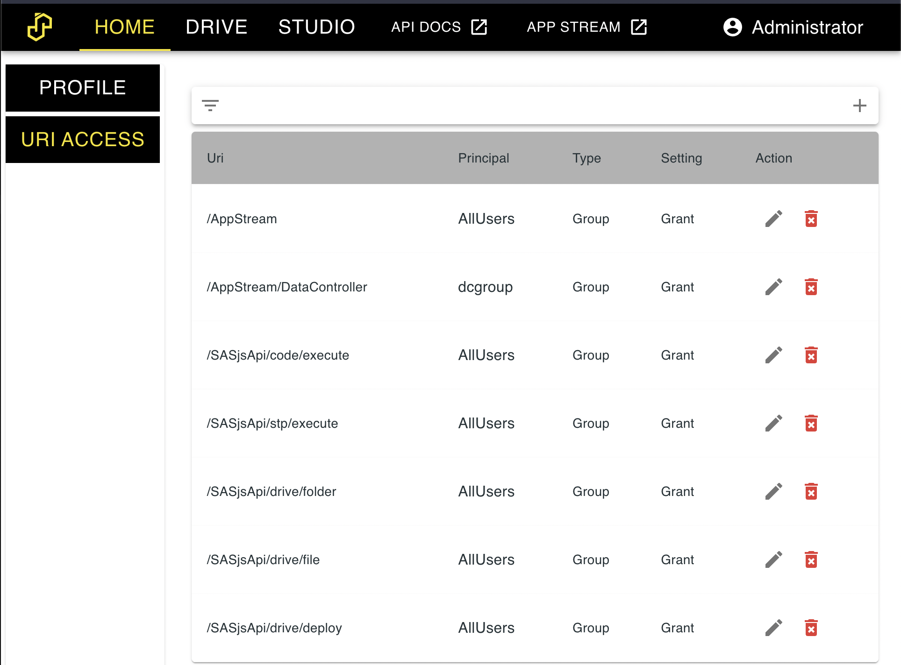

# Permissions

Permissions in SASjs are enabled when `MODE=server`.   Rules do not apply to admin users.  The menu is available under SETTINGS, and is divided into "URI Access" and "Folder Access".  Rules can be at GROUP or USER level.

The hierarchy of rules is as follows:

* By default, deny all
* Apply group grants
* Apply group deny
* Apply user grants
* Apply user deny

## URI Access

URI rules can be applied to the following endpoints:

* /AppStream
* /SASjsApi/code/execute
* /SASjsApi/stp/execute
* /SASjsApi/drive/deploy
* /SASjsApi/drive/deploy/upload
* /SASjsApi/drive/file
* /SASjsApi/drive/folder
* /SASjsApi/drive/fileTree
* /SASjsApi/permission

They can also be applied to individual apps.  This part of the list is dynamically generated, for example:

* /AppStream/DataController
* /AppStream/Mario
* /AppStream/Sonic

## Folder Access

Coming soon.  Need it sooner?  [Sponsor us](https://github.com/sponsors/sasjs)!

