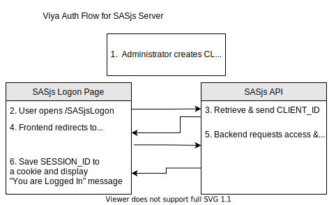

# Roadmap

## Authentication

The below are simply notes, in relation to the potential for additional authentication options for SASjs Server.

> Regardless of the mechanism used, credentials and user attributes are encrypted and stored internally as a JWT token. The token is associated with a SASjs Session ID, which is passed in each API request inside an `Authorisation:` header attribute OR a cookie.

## Viya Auth
This approach is recommended whenever Viya authorisation is available. The configuration steps are as follows:

1. Configure SASjs Server for Viya Auth
2. Register a client and secret (administrator task) using the **authorization_code** grant type.  Here are some [helpful resources](https://cli.sasjs.io/faq/#how-can-i-obtain-a-viya-client-and-secret).
3. Enter the client / secret into the SASjs database (tool to be provided)

The user flow is as follows:

1. Navigate to {SASjsServerUrl}/SASjsLogon
2. Click "LOGON"

Behind the scenes, the following flow will occur:

1. `/SASjsLogon` page will request the CLIENT_ID from `/SASjsApi/auth/viyaclientid` (unsecured endpoint)
2. The user is redirected to `/SASLogon/oauth/authorize?response_type=code&client_id=${CLIENT_ID}`
3. Following authentication, the frontend will pass the AUTH_CODE to backend
4. Backend will send CLIENT_ID, CLIENT_SECRET and AUTH_CODE to `/SASLogon/oauth/token`, receiving the ACCESS_TOKEN and REFRESH_TOKEN in response
5. The ACCESS_TOKEN and REFRESH_TOKEN are stored (securely) in a JWT, and associated with a SASjs SESSION_ID
6. The SESSION_ID is returned to `/SASjsLogon` and stored in a cookie
7. Subsequent requests by the Frontend, or API clients, will make use of the SASjs Session ID (until expiry).
8. If the ACCESS_TOKEN expires, the backend will refresh it automatically using the REFRESH_TOKEN.

The following diagram illustrates:

## Auth0

Auth0 is a third party authentication provider, which supports all major authentication methods - such as SAML, SSO, LDAP, Social Logins, etc etc.

