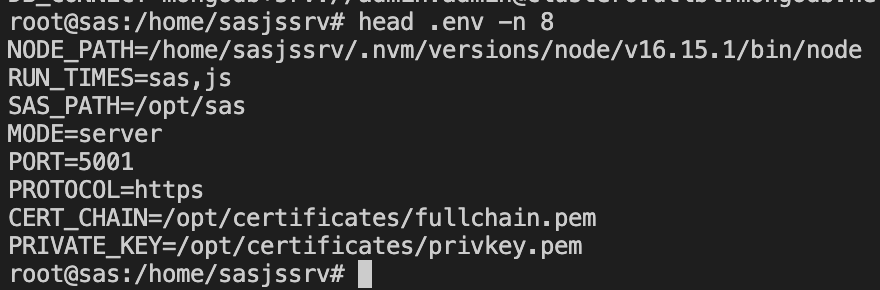
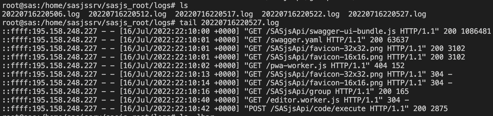

# Settings

All settings in SASjs server are made by means of environment variables.  These can be set in the following places:

- Configured globally in `/etc/environment` file
- Export in terminal or shell script (export VAR=VALUE)
- Prepended in the command
- Enter in the `.env` file alongside the executable

The usual / preferred method is to provide the variables in the `.env` file (which works on both Windows & Linux) as follows:


## Environment Variables

### AUTH_PROVIDERS

Used to list the desired Authentication providers (space separated).  Currently only LDAP (`ldap`) is supported, but we plan to allow other providers such as Viya, Okta, OpenID, and LNURL-auth.

Example:
```
AUTH_PROVIDERS=ldap
```

### ALLOWED_DOMAIN

Prevent authentication from other domains by listing the primary domain here.  This will reject cookies arriving from any other domain.  Used only when `MODE=server`, and only relevant for SASjs Studio / SASjs Logon.  

Example:
```
ALLOWED_DOMAIN=sas.company.com
```

For API use by different servers / domains, see [CORS](/settings/#cors) and [WHITELIST](/settings/#whitelist) settings.

### CERT_CHAIN

Necessary when `PROTOCOL=https`

Example: `CERT_CHAIN=localhost.crt`

See also:

* [`PROTOCOL`](/settings/#protocol)
* [`CA_ROOT`](/settings/#ca_root)
* [`PRIVATE_KEY`](/settings/#private_key)

Developer notes: processed internally as [`cert:` option](https://nodejs.org/api/tls.html#tlscreatesecurecontextoptions) which has this description:

> Cert chains in PEM format. One cert chain should be provided per private key. Each cert chain should consist of the PEM formatted certificate for a provided private key, followed by the PEM formatted intermediate certificates (if any), in order, and not including the root CA (the root CA must be pre-known to the peer, see ca). When providing multiple cert chains, they do not have to be in the same order as their private keys in key. If the intermediate certificates are not provided, the peer will not be able to validate the certificate, and the handshake will fail.

### CA_ROOT

Necessary when `PROTOCOL=https` AND the server uses a self-signed certificate.

Example: `CA_ROOT=fullchain.pem`

See also:

* [`PROTOCOL`](/settings/#protocol)
* [`CA_ROOT`](/settings/#ca_root)
* [`PRIVATE_KEY`](/settings/#private_key)

Developer notes: processed internally as [`ca:` option](https://nodejs.org/api/tls.html#tlscreatesecurecontextoptions) which has this description:

> Optionally override the trusted CA certificates. Default is to trust the well-known CAs curated by Mozilla. Mozilla's CAs are completely replaced when CAs are explicitly specified using this option. The value can be a string or Buffer, or an Array of strings and/or Buffers. Any string or Buffer can contain multiple PEM CAs concatenated together. The peer's certificate must be chainable to a CA trusted by the server for the connection to be authenticated. When using certificates that are not chainable to a well-known CA, the certificate's CA must be explicitly specified as a trusted or the connection will fail to authenticate. If the peer uses a certificate that doesn't match or chain to one of the default CAs, use the ca option to provide a CA certificate that the peer's certificate can match or chain to. For self-signed certificates, the certificate is its own CA, and must be provided. For PEM encoded certificates, supported types are "TRUSTED CERTIFICATE", "X509 CERTIFICATE", and "CERTIFICATE". See also tls.rootCertificates.

### CORS

Options: [disable|enable]
Default: `disable` for `server` & `enable` for `desktop`

If enabled, it is also necessary to configure the [`WHITELIST`](/settings/#whitelist) of additional server(s).

### DB_CONNECT
Necessary for server mode.  Connection string for Mongo DB instance.  Example:
```
DB_CONNECT=mongodb+srv://<DB_USERNAME>:<DB_PASSWORD>@<CLUSTER>/<DB_NAME>?retryWrites=true&w=majority
```

### HELMET_COEP

HELMET Cross Origin Embedder Policy.  Sets the Cross-Origin-Embedder-Policy header to require-corp when `true`

Options: [true|false]

Default: true

Docs: [https://helmetjs.github.io/#reference](https://helmetjs.github.io/#reference) (`crossOriginEmbedderPolicy`)

###  HELMET_CSP_CONFIG_PATH

HELMET Content Security Policy

Path to a json file containing HELMET `contentSecurityPolicy` directives

Docs: [https://helmetjs.github.io/#reference](https://helmetjs.github.io/#reference)

Example config:
```
{
  "img-src": ["'self'", "data:"],
  "script-src": ["'self'", "'unsafe-inline'"],
  "script-src-attr": ["'self'", "'unsafe-inline'"]
}
```

Example: `HELMET_CSP_CONFIG_PATH=./csp.config.json`

### LDAP_URL

The URL of the LDAP directory server.

Example:
```
LDAP_URL= ldaps://LDAP_SERVER_URL:PORT
```

### LDAP_BIND_DN

Example:
```
LDAP_BIND_DN=cn=admin,ou=system,dc=companyname
```

### LDAP_BIND_PASSWORD 

All LDAP queries have to be authenticated with this secret and the LDAP_USERS_BASE_DN

Example:
```
LDAP_BIND_PASSWORD = <password>
```

### LDAP_USERS_BASE_DN

```
LDAP_USERS_BASE_DN = ou=users,dc=companyname
```

### LDAP_GROUPS_BASE_DN

```
LDAP_GROUPS_BASE_DN = ou=groups,dc=companyname
```

### LOG_FORMAT_MORGAN

These setting determines the level of logging produced by SASjs server.
More details on this can be found in the Morgan documentation here:[https://www.npmjs.com/package/morgan#predefined-formats](https://www.npmjs.com/package/morgan#predefined-formats)

Options: [`combined`|`common`|`dev`|`short`|`tiny`]

Default: `common`

### LOG_LOCATION

Location in which to write server logs (one file per day).  If not provided, logs are written in a `/logs` subfolder of the `SASJS_ROOT` location.  Can be a full path, else relative to the directory in which the server instance was launched.  More information on the behaviour (eg log rotation) is available in the underlying package ([rotating-file-stream](https://www.npmjs.com/package/rotating-file-stream)).

Example: `LOG_LOCATION=./sasjs_root/logs`



### MOCK_SERVERTYPE

Used internally for CLI / Adapter testing - set to `SAS9` or `SASVIYA` when launching to enable responses in the format of alternative platforms.  These mocks are not functional, and have no use outside of development / testing purposes.

Default: `SASJS`

### MODE

Whether to launch the server in `desktop` (single user / workstation) or `server` mode (multi-user).  For server mode, a Mongo DB connection string must be provided in the [DB_CONNECT](#db_connect) variable.

Default: `desktop`

### NODE_PATH

The path to the NodeJS executable (for running JavaScript programs).

Example: `NODE_PATH=~/.nvm/versions/node/v16.14.0/bin/node`

See also:

* [`PYTHON_PATH`](/settings/#python_path)
* [`RUN_TIMES`](/settings/#run_times)
* [`SAS_PATH`](/settings/#sas_path)

### PORT
The port on which to serve.  Default: 5000

Binding processes to ports in the lower ranges (eg 80, 443) requires elevated privileges.  To avoid running SASjs Server under a privileged account, you can bind the port to an executable - eg:  `setcap 'cap_net_bind_service=+ep' /home/sasjssrv/api-linux`

If the executable is updated (eg downloading a new version) you will need to run this command again.

### PRIVATE_KEY

Necessary when `PROTOCOL=https`

Example: `PRIVATE_KEY=localhost.key`

See also:

* [`PROTOCOL`](/settings/#protocol)
* [`CA_ROOT`](/settings/#ca_root)
* [`CERT_CHAIN`](/settings/#cert_chain)

Developer notes: processed internally as [`key:` option](https://nodejs.org/api/tls.html#tlscreatesecurecontextoptions) which has this description:

> Private keys in PEM format. PEM allows the option of private keys being encrypted. Encrypted keys will be decrypted with options.passphrase. Multiple keys using different algorithms can be provided either as an array of unencrypted key strings or buffers, or an array of objects in the form {pem: <string|buffer>[, passphrase: <string>]}. The object form can only occur in an array. object.passphrase is optional. Encrypted keys will be decrypted with object.passphrase if provided, or options.passphrase if it is not.

### PROTOCOL

Whether to use `http` or `https` protocol. Default: `http`.

See also:

* [`CA_ROOT`](/settings/#ca_root)
* [`CERT_CHAIN`](/settings/#cert_chain)
* [`PRIVATE_KEY`](/settings/#private_key)

### PYTHON_PATH

The path to the Python executable (for running Python programs).

Example: `PYTHON_PATH=/usr/bin/python`

See also:

* [`NODE_PATH`](/settings/#node_path)
* [`R_PATH`](/settings/#r_path)
* [`RUN_TIMES`](/settings/#run_times)
* [`SAS_PATH`](/settings/#sas_path)
  
# R_PATH

The path to the R executable (for running R programs).  Installation guides for R are available for [Centos 7](https://linuxize.com/post/how-to-install-r-on-centos-7/), [ubuntu](https://www.digitalocean.com/community/tutorials/how-to-install-r-on-ubuntu-20-04) and [Debian](https://www.digitalocean.com/community/tutorials/how-to-install-r-on-debian-10).
  
Example: `R_PATH=/usr/bin/Rscript`
  
* [`NODE_PATH`](/settings/#node_path)
* [`PYTHON_PATH`](/settings/#python_path)
* [`RUN_TIMES`](/settings/#run_times)
* [`SAS_PATH`](/settings/#sas_path)


### RUN_TIMES
A comma separated string that defines the available runtimes.

**Priority is given to the runtime that comes first in the string**.

Given a `RUNTIME=js,sas,py`:
  
* If `_program=/some/program` then SASjs Server will first look for `program.js` in the `/some` folder, then `program.sas`, and finally `program.py`.
* If `_program=/some/program.sas` then a SAS runtime will always be used.
* If `_program=/some/program.r` then an R runtime will be used (and so-on)

Supported runtimes:

* `js` - JavaScript
* `sas` - SAS
* `py` - Python
* `r` - R

Default: `sas,js,py`

Example:

`RUN_TIMES=js,sas,py`

### SAS_OPTIONS

Windows only. See: [https://documentation.sas.com/doc/en/pgmsascdc/9.4_3.5/hostwin/p0drw76qo0gig2n1kcoliekh605k.htm#p09y7hx0grw1gin1giuvrjyx61m6](https://documentation.sas.com/doc/en/pgmsascdc/9.4_3.5/hostwin/p0drw76qo0gig2n1kcoliekh605k.htm#p09y7hx0grw1gin1giuvrjyx61m6)

Example:  `SAS_OPTIONS= -NOXCMD`

### SAS_PATH
The full path to the SAS executable (sas.exe / sas.sh).  It is highly recommended to provide an instance with UTF-8 encoding, for the following reasons:

* SASjs Adapter compatibility
* Broad language support
* Viya compatibility

To force UTF-8 encoding, update the appropriate `sasv9.cfg` file with the following option:

```
-ENCODING UTF-8
```

Example:

`SAS_PATH=/path/to/sas/executable.exe`

See also:

* [`NODE_PATH`](/settings/#node_path)
* [`PYTHON_PATH`](/settings/#python_path)
* [`RUN_TIMES`](/settings/#run_times)


### SASJS_ROOT

If omitted, this will be the SASjs Server installation directory.  The location is used for SAS WORK, staged files, DRIVE, configuration etc

Example:

`SASJS_ROOT=./sasjs_root`


### SASV9_OPTIONS
Unix only.  See: [https://documentation.sas.com/doc/en/pgmsascdc/9.4_3.5/hostunx/p0wrdmqp8k0oyyn1xbx3bp3qy2wl.htm](https://documentation.sas.com/doc/en/pgmsascdc/9.4_3.5/hostunx/p0wrdmqp8k0oyyn1xbx3bp3qy2wl.htm)

Example: `SASV9_OPTIONS= -NOXCMD`


### WHITELIST
Space separated urls, eg: `WHITELIST=http://localhost:3000 https://abc.com`.  
  
See also:

* [`CORS`](/settings/#cors)


